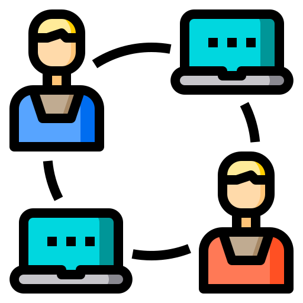

<h1 align="center">
  
</h1>

<p align="center">
  
  
  
  
  
  <a href="https://github.com/gabrielmaialva33/iecare-api/commits/master">
    
      
  </a>
</p>

<br>

<p align="center">
    <a href="README.md">English</a>
    ·
    <a href="README-pt.md">Portuguese</a>
</p>

<p align="center">
  <a href="#bookmark-about">Sobre</a>&nbsp;&nbsp;&nbsp;|&nbsp;&nbsp;&nbsp;
  <a href="#computer-technologies">Tecnologias</a>&nbsp;&nbsp;&nbsp;|&nbsp;&nbsp;&nbsp;
  <a href="#wrench-tools">Ferramentas</a>&nbsp;&nbsp;&nbsp;|&nbsp;&nbsp;&nbsp;
  <a href="#package-installation">Instalação</a>&nbsp;&nbsp;&nbsp;|&nbsp;&nbsp;&nbsp;
  <a href="#memo-license">Licença</a>
</p>

<br>

## :bookmark: Sobre

**IECare API** é uma API base de lista de controle de acesso que espera atender a muitos projetos estriado em **Go**.

<kbd>
  
</kbd>

<br>

## :computer: Tecnologias

- **[Go](https://go.dev/)**
- **[PostgreSQL](https://www.postgresql.org/)**
- **[Docker](https://www.docker.com/)**
  <br>

## :wrench: Ferramentas

- **[GoLand](https://www.jetbrains.com/goland/)**
- **[Insomnia](https://insomnia.rest/)**
- **[DataGrip](https://www.jetbrains.com/datagrip/)**

<br>

## :package: Instalação

### :heavy_check_mark: **Pré-requisitos**

Os seguintes softwares devem estar instalados:

- **[Go](https://go.dev/dl/)**
- **[Git](https://git-scm.com/)**
- **[PostgreSQL](https://www.postgresql.org/download/)** or **[Docker](https://www.docker.com/get-started/)**

<br>

### :arrow_down: **Clonando o repositório**

```sh
  $ git clone https://github.com/gabrielmaialva33/iecare-api.git
```

<br>

### :arrow_forward: **Rodando o backend**

- :package: API

```sh
  $ cd iecare-api
  # Dependencies install.
  $ go mod tidy
  # Config environment system
  $ cp .env.example .env
  # API start
  $ go run cmd/main.go
```

<br>

## :twisted_rightwards_arrows: Rotas

Arquivo de rotas [Download](https://raw.githubusercontent.com/gabrielmaialva33/iecare-api/master/.github/assets/Insomnia.zip)

## :memo: Licença

O projeto está sobre a licença [MIT](./LICENSE) ❤️

Gostou? Deixe uma estrela para ajudar o projeto ⭐
