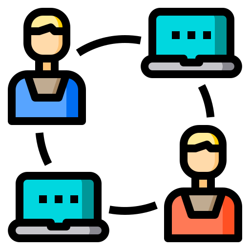
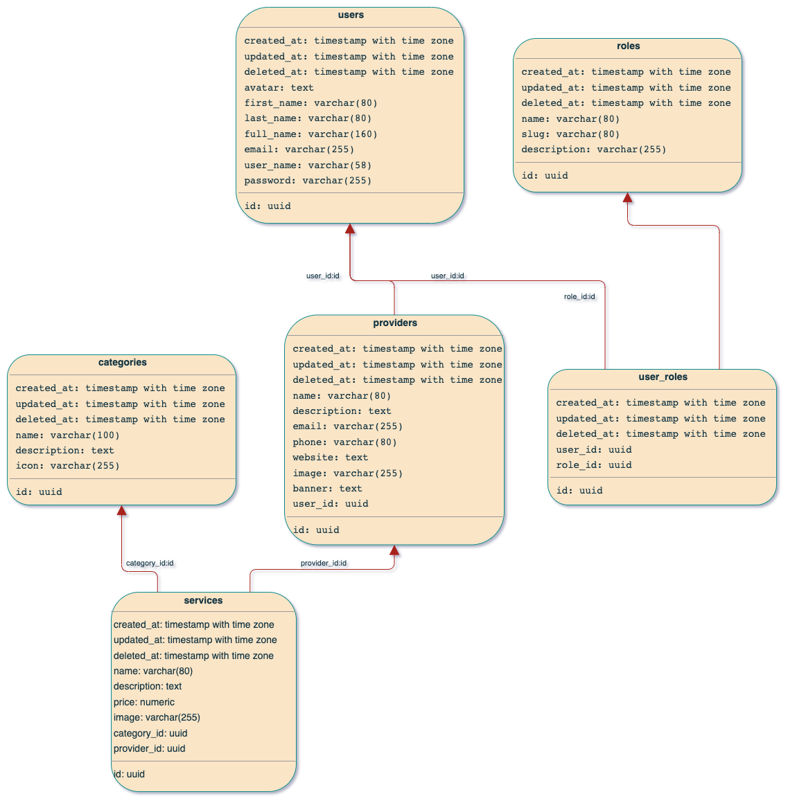

<h1 align="center">
  
</h1>

<p align="center">
  
  
  
  
  
  <a href="https://github.com/gabrielmaialva33/iecare-api/commits/master">
    
      
  </a>
</p>

<br>

<p align="center">
    <a href="README.md">English</a>
    ·
    <a href="README-pt.md">Portuguese</a>
</p>

<p align="center">
  <a href="#bookmark-about">About</a>&nbsp;&nbsp;&nbsp;|&nbsp;&nbsp;&nbsp;
  <a href="#computer-technologies">Technologies</a>&nbsp;&nbsp;&nbsp;|&nbsp;&nbsp;&nbsp;
  <a href="#wrench-tools">Tools</a>&nbsp;&nbsp;&nbsp;|&nbsp;&nbsp;&nbsp;
  <a href="#package-installation">Installation</a>&nbsp;&nbsp;&nbsp;|&nbsp;&nbsp;&nbsp;
  <a href="#memo-license">License</a>
</p>

<br>

## :bookmark: About

**IECare API ** is an access control list base api that hopes to serve many projects written in Go.

<kbd>
  
</kbd>

<br>

## :computer: Technologies

- **[Go](https://go.dev/)**
- **[PostgreSQL](https://www.postgresql.org/)**
- **[Docker](https://www.docker.com/)**

<br>

## :wrench: Tools

- **[GoLand](https://www.jetbrains.com/goland/)**
- **[Insomnia](https://insomnia.rest/)**
- **[DataGrip](https://www.jetbrains.com/datagrip/)**

<br>

## :package: Installation

### :heavy_check_mark: **Prerequisites**

The following software must be installed:

- **[Go](https://go.dev/dl/)**
- **[Git](https://git-scm.com/)**
- **[PostgreSQL](https://www.postgresql.org/download/)** or **[Docker](https://www.docker.com/get-started/)**

<br>

### :arrow_down: **Cloning the repository**

```sh
  $ git clone https://github.com/gabrielmaialva33/iecare-api.git
```

<br>

### :arrow_forward: **Running the application**

- :package: API

```sh
  $ cd iecare-api
  # Dependencies install.
  $ go mod tidy
  # Config environment system
  $ cp .env.example .env
  # API start
  $ go run cmd/main.go
```

<br>

## :twisted_rightwards_arrows: Routes

Get routes for
insomnia [Download](https://raw.githubusercontent.com/gabrielmaialva33/iecare-api/master/.github/assets/Insomnia.zip)

## :memo: License

This project is under the **MIT** license. [MIT](./LICENSE) ❤️

Liked? Leave a little star to help the project ⭐
